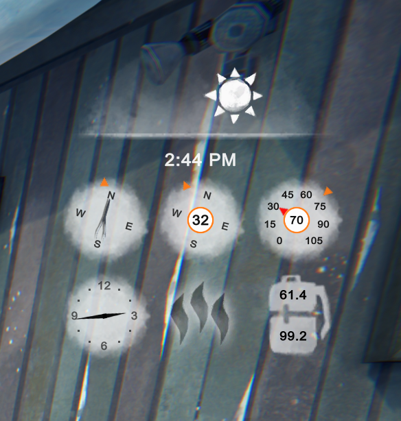
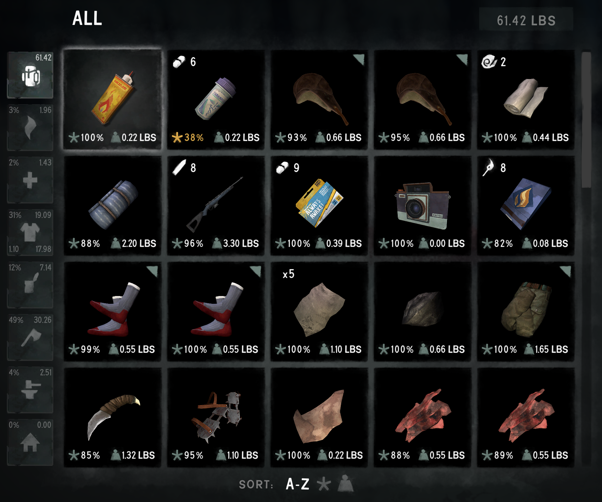
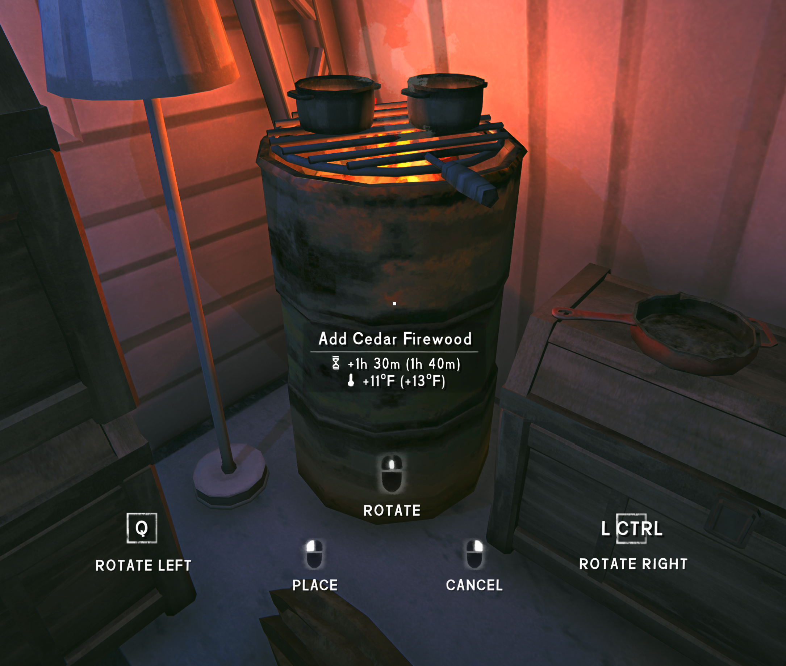
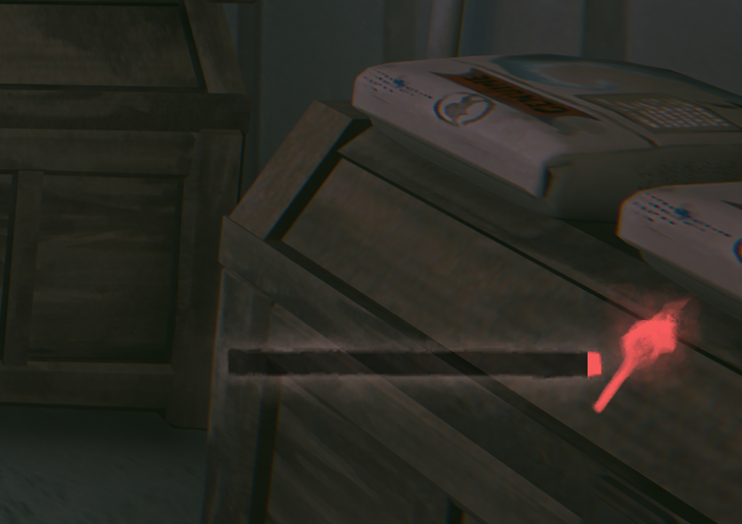
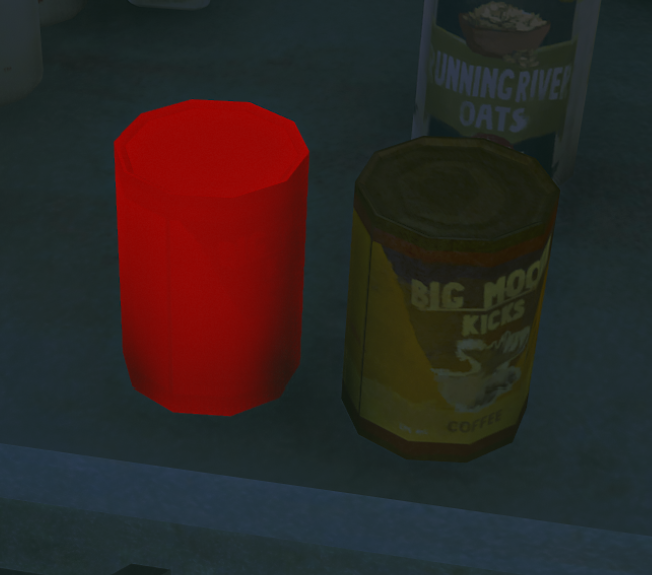
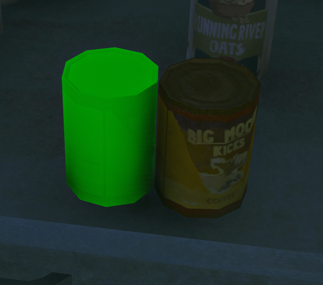
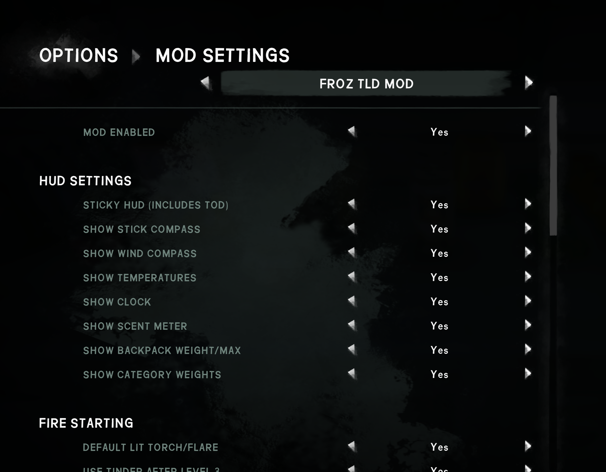

# Froz TLD Mod

**Froz TLD Mod is a configurable collection of quality-of-life improvements for *The Long Dark*.**

It started as a better way to keep useful survival information visible and grew into a broader set of fixes for the small frustrations that repeat throughout a run: checking the weather, starting fires, selecting tools, managing inventory weight, placing gear, and switching weapons.

The goal is not to turn *The Long Dark* into a different game. Froz TLD Mod keeps the original look and behavior wherever possible, then quietly improves the parts that create unnecessary repetition. Every major feature can be enabled or disabled from **Mod Settings**.

## Highlights

### A more useful survival HUD

Press **Tab** to show or hide a compact HUD built around the game's time-of-day display. Sticky mode keeps it visible until you toggle it off.

The HUD can include:

- A community-style **stick compass**
- Wind direction and wind speed
- Current and outdoor feels-like temperatures
- An analog clock
- The game's scent indicator
- Current backpack weight and maximum carry capacity
- Backpack category weights, including carried and worn clothing totals

Each element can be turned on or off independently.

Category totals and percentages can also be displayed directly beside the backpack filters, including separate carried and worn clothing weights.

### Less friction around fire

Froz TLD Mod improves several repetitive fire-starting interactions:

- Prefer a lit torch or flare when one is already in hand
- Default to sticks as starting fuel when available
- Continue using optional tinder after Fire Starting Level 3
- Prevent Birch Bark from being selected automatically
- Right-click loose sticks, wood, coal, or other valid fuel and place it directly onto a burning fire

When dragging fuel into a fire, the game-style interaction panel shows the added burn time, temperature increase, and resulting totals before you commit.

### Remembers the choices you already made

The game often asks you to select the same tool repeatedly. Froz TLD Mod remembers your last selection for:

- Crafting
- Breaking down objects
- Harvesting and quartering carcasses
- Making and clearing ice-fishing holes

It also remembers the exact weapon you selected, including individual condition variants, for the weapon hotkey and radial menu.

### Weapon reticles

Optional reticles are available for pistols, rifles, and the flare gun. The pistol hip-fire reticle follows the game's actual impact calculation instead of assuming the center of the screen is correct.

### Light-source life warning

Torch, flare, and lantern life indicators gradually turn red as the light source approaches empty, making it easier to notice before it goes out.

### Item Placement Collision

Items can inherit oversized placement collision boundaries, especially dropped items, forcing unnatural gaps between bottles, cans, firewood, and other loose gear. Froz TLD Mod corrects those excessive boundaries so loose items can be placed closely beside one another while still preventing overlap.

This is not **Place Anywhere** functionality. It does not disable normal placement rules, allow objects to clip through each other, or add unrestricted positioning controls. It specifically fixes the game's overly large item-to-item placement colliders, including the especially noticeable spacing applied to freshly dropped items.

| Oversized placement boundary | Corrected placement footprint |
| --- | --- |
|  |  |

### Small fixes that add up

- Control Aurora ambience and Aurora-powered electrical sounds separately
- Skip the startup disclaimer sequence through Hinterland's built-in `-skipintro` behavior

## Configuration

Features can be enabled independently from **Options > Mod Settings > FROZ TLD MOD**. The master switch disables the entire mod without removing it.

## Requirements

- *The Long Dark: Survival Mode* on Windows
- [MelonLoader](https://github.com/LavaGang/MelonLoader) 0.7.2
- [ModSettings](https://www.tldmods.net/)

Each release will identify the game and MelonLoader versions it was tested with.

## Installation

1. Install MelonLoader and launch the game once.
2. Install ModSettings mod.
3. Download the latest `FrozTLDMod.zip` from the [Releases](../../releases) page.
4. Extract the archive into the game's `Mods` folder.
5. Confirm these files exist:
   - `Mods/FrozTLDMod/FrozTLDMod.dll`
   - `Mods/FrozTLDMod/manifest.json`
6. Launch the game and open **Options > Mod Settings > FROZ TLD MOD**.

## Updating

Download the newest release and replace the existing `Mods/FrozTLDMod` folder. Your Mod Settings are stored separately and should remain intact.

## Reporting problems

Use the [Issues](../../issues) page to report a problem with a published release. Please include:

- The Froz TLD Mod version
- The Long Dark version
- The MelonLoader version
- A short description of what happened
- The relevant section of `MelonLoader/Latest.log`, when available

## About this repository

This is the official public download and support repository for Froz TLD Mod. It contains release packages and player documentation; the source code is maintained separately.

## Disclaimer

Froz TLD Mod is an unofficial community modification and is not affiliated with or supported by Hinterland Studio. Please direct mod-related support requests [here](../../issues) or to the *The Long Dark* modding community, not to Hinterland.
